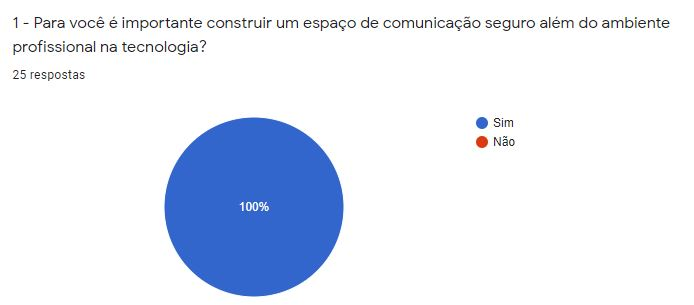
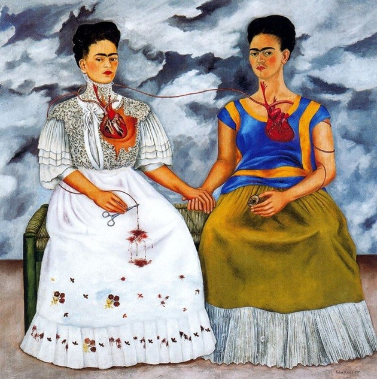
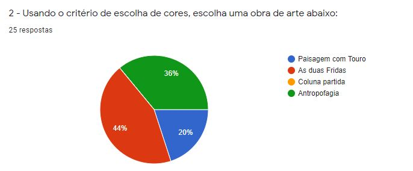
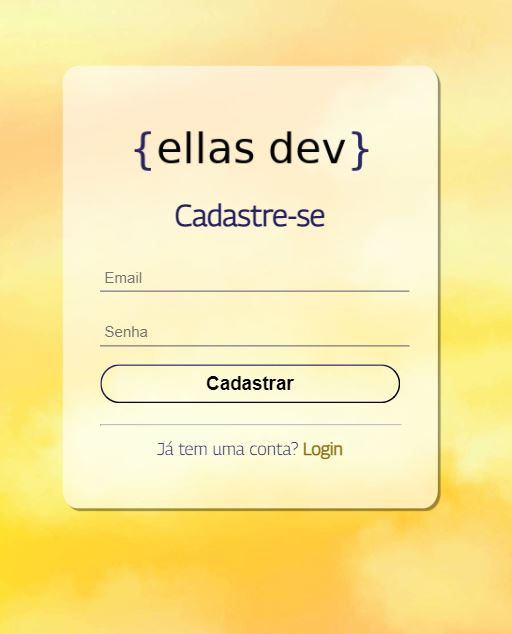
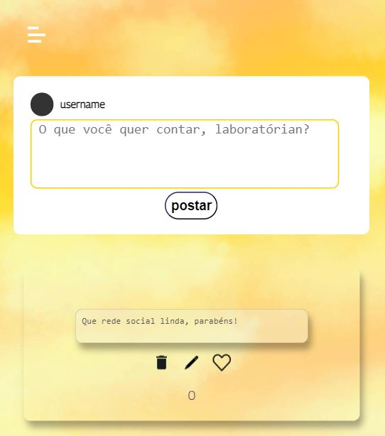
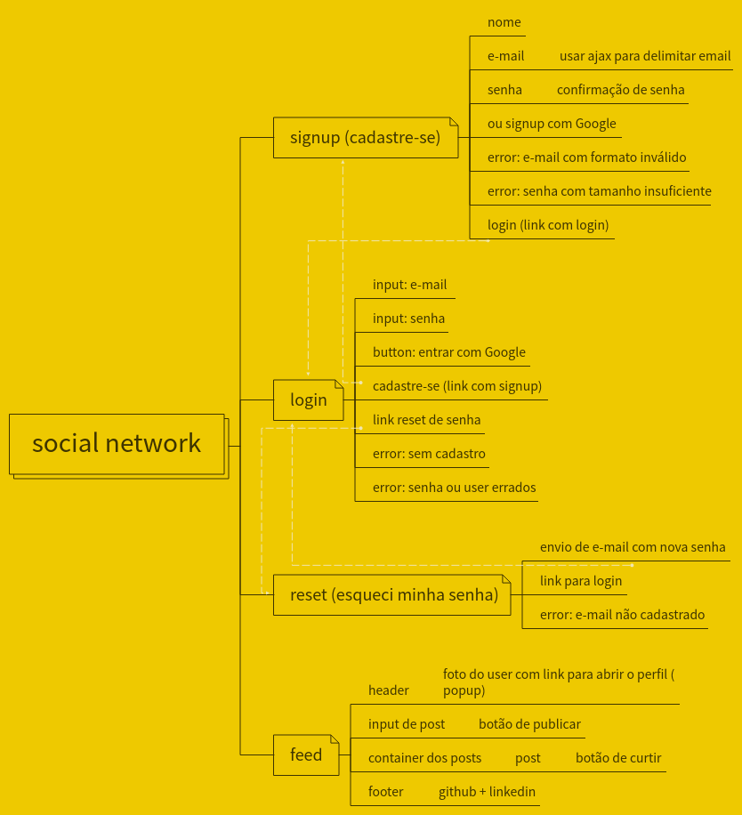

# {Ellas Dev}

## Índice

- [1. Sobre](#1-Sobre)
- [2. Histórias de Usuários](#2-Histórias-de-Usuários)
- [3. Layout](#3-Layout)
- [4. Produto Final](#4-Produto-Final)
- [5. Planejamento](#5-Planejamento)
- [6. Metodologias e Tecnologias](#6-Metodologias-e-Tecnologias)
- [7. Autoras](#7-autoras)

Proposta.

 

## 1. Sobre

Ellas Dev é uma rede social pensada para alunas e ex alunas da [Laboratoria Brasil](https://www.laboratoria.la/br), com a intenção de facilitar trocas de experiências, network e divisão de conhecimento. A rede social permite publicação de posts inspirada no Twitter, possibilitando dar like em posts favoritos.

<h4> Você pode acessar a aplicação <a href="rede-social-70f9c.web.app">clicando aqui</a></h4>

## 2. Histórias de Usuários
Para o desenvolvimento de produtos voltado para o usuário, utilizamos pesquisas de UX designer, com base no tema as personas são pré estabelecidas, então buscamos identificar o melhor conceito de cores e interface.

Para os nossos usuários é importante um espaço voltado para mulheres na tecnologia.

 
  

Escolhemos quatro obras de artistas mulheres para a definição de protótipo e cores.

A Obra escolhida:

  

Resultado da pesquisa:

  

## 3. Layout

Protótipo de baixa fidelidade:

  

## 4. Produto Final

Tela de login:

  

Tela de Cadastro:

  

Tela de feed:

  

## 5. Planejamento

O fluxograma descreve um processo, sistema ou algoritmo de computador. São amplamente utilizados para documentar, estudar, planejar, melhorar e comunicar processos complexos por meio de diagramas claros e fáceis de entender. Para definirmos o seguimento do trabalho em dupla, utilizamos para definir o fluxo das pastas contendo cada itens da aplicação final.

  

## 6. Metodologias e Tecnologias
- Scrum           
- kanban
- Github projects 
- VSC
- Farebase       
- Figma
- Node            
- JavaScript
- HTML            
- CSS

## 7. Autoras

Cris
[GitHub](https://github.com/crisbdev) 

Mag
[GitHub](https://github.com/Magnadutra)
